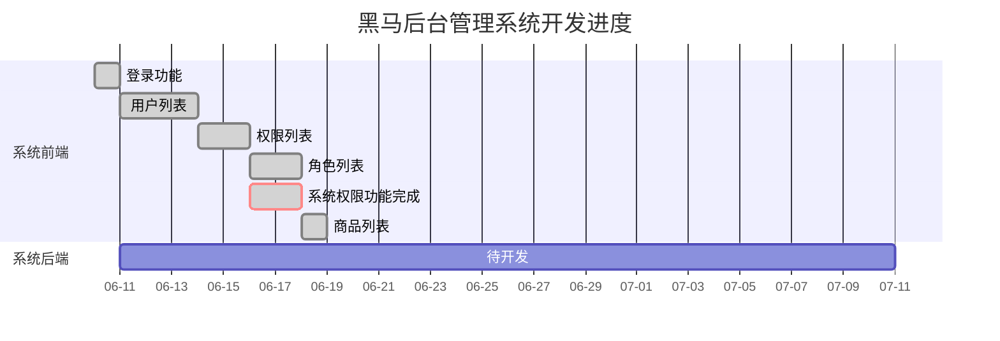

# heima-back-manager
b站视频看至https://www.bilibili.com/video/BV1PJ411X7Jp?p=235




### 目录介绍

window下使用命令符`tree [drive:][path] [/F] [/A]`

> 参数:
> 1. drive 盘符
> 2. path 文件路径
> 3. /F 递归列出所有文件
> 4. /A 使用ASCII字符,而不是用扩展字符

输出到一个文件中:`tree [drive:][path] > [drive:][path]\r.txt`

```
├─mock //开发阶段数据模拟
├─public
└─src
    ├─assets // 静态资源
    ├─components //组件
    ├─filter //vue过滤器
    ├─plugins  //vue插件
    ├─router  //路由
    ├─store  //vuex
    └─views    //视图
```

### element-ui的安装与导入
```
npm i element-ui -S

import ElementUI from 'element-ui'
import 'element-ui/lib/theme-chalk/index.css'
Vue.use(ElementUI)
```

### 项目分支1 - login
> 该分支专门写登录功能
> git checkout -b 分支名


### 利用axios编写一个ajax请求的vue插件
```js
import axios from 'axios'
const MyHttpServer = {};
MyHttpServer.install = (Vue,options)=>{
    Vue.prototype.$http = axios;
}

export default MyHttpServer;

//在main.js中使用
import httpServer from '@/plugins/http'
Vue.use(httpServer);
```

### 合并分支
```
1. 切到主分支
2. git merge 分支名
3. git push
```

### vue过滤器
```js
Vue.filter('过滤器名字',(value)=>{});

//使用
{{datetime | 过滤器名字}}
```

## 自定义全局组件
在 `main.js`中,引入组件后,`Vue.component('全局组件名' || 引入组件.name,引入的组件)`

## 权限系统实现
用户登录后,后台返回一个`token`,进入主页面请求用户左侧菜单栏接口时会携带这个`token`,后台解析并返回该用户对应的数据